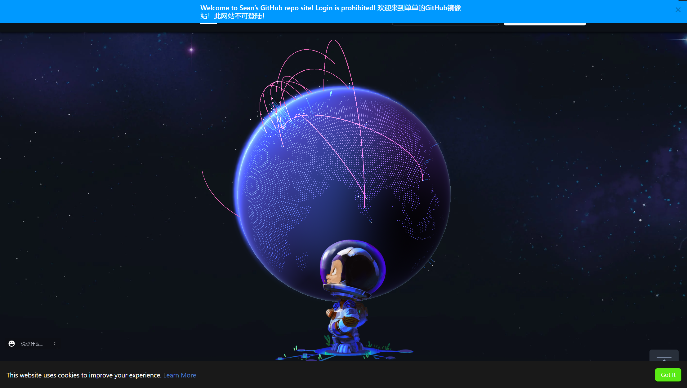

# Github Mirror

First, lets talk about Github Mirrors. If you access Github from all around the world, you might found Github being blocked somewhere in your region. But with Sean Github Mirror, you can access it in real quick.

## How to use it?

1. First, open a browser something like Google Chrome.
2. Click the link below to enter the Github Mirror: [Link](https://seangithubproxy.eu.org)

Then, you will see the page same as github.com

## Some pictures

main page:

Personal page:

.png>)

## Something to know

<mark style="color:red;">Be aware, you are not allowed to login in the mirror pages. If you want to login, please go to github.com</mark>
